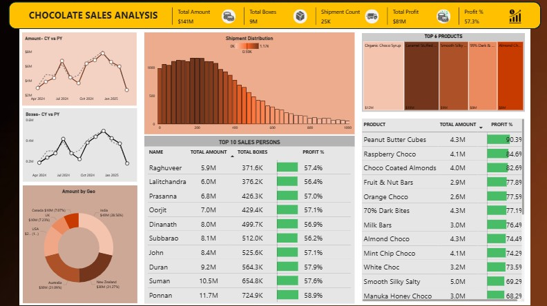

# 📊Chocolate Sales Analysis
## Project Overview

The Chocolate Sales Analysis Dashboard is a Business Intelligence solution developed in Power BI to analyze sales performance, profitability, shipment activity, and salesperson effectiveness.

The objective of this project is to transform raw shipment and sales data into actionable business insights that support data-driven decision-making. The dashboard enables stakeholders to monitor key performance indicators, identify revenue drivers, evaluate sales performance, and track year-over-year business growth.

---

## Business Problem

Management required a centralized reporting solution to answer critical business questions related to sales performance, profitability, shipment efficiency, and sales team effectiveness.

The organization lacked visibility into:

1. Overall profitability generated from chocolate sales.
2. Shipment volume and operational activity.
3. Revenue generated per shipped box.
4. Top-performing sales representatives.
5. Sales growth compared to previous periods.

This dashboard addresses these challenges by providing a single interactive view of business performance.

---

## Dashboard Preview

<p align="center">
  
</p>

---


## Business Questions Answered

### 1. What is the overall profit generated by the business?
Analyzed total profit earned across all chocolate products and sales transactions to evaluate business profitability.

### 2. How many shipments were completed?
Measured shipment activity to understand operational volume and customer fulfillment performance.

### 3. What is the average revenue generated per shipped box?
Calculated the Amount per Box KPI to assess shipment efficiency and revenue contribution at the unit level.

### 4. Who are the top-performing salespersons?
Ranked sales representatives based on total sales amount to identify high performers and support performance evaluation.

### 5. How does current year performance compare with previous year?
Performed Year-over-Year (YoY) sales analysis to identify growth trends, seasonal patterns, and changes in business performance.

---

## Dashboard Features

### Executive KPI Monitoring
- Total Sales Amount
- Total Profit
- Profit Percentage
- Shipment Count
- Total Boxes Shipped

### Sales Performance Analysis
- Top 10 Salesperson Ranking
- Sales Contribution Analysis
- Revenue Performance Tracking

### Operational Insights
- Shipment Distribution Analysis
- Amount per Box Calculation
- Shipment Volume Monitoring

### Trend Analysis
- Current Year vs Previous Year Sales Comparison
- Monthly Sales Trend Analysis
- Growth Pattern Identification

### Product-Level Insights
- Product-wise Revenue Analysis
- Product-wise Profitability Analysis

---

## Key Metrics Developed

| KPI | Description |
|-------|------------|
| Total Amount | Total revenue generated from sales |
| Total Profit | Overall business profit |
| Profit % | Profitability percentage |
| Shipment Count | Total shipments completed |
| Total Boxes | Total boxes shipped |
| Amount per Box | Revenue generated per shipped box |
| YoY Sales Growth | Current year vs previous year sales comparison |

---

## Data Preparation

The dataset was cleaned and transformed using Power Query.

Key transformation activities included:

- Data validation and quality checks
- Handling missing values
- Creating calculated columns
- Building a Date Dimension table
- Establishing data model relationships
- Preparing data for time intelligence calculations

---

## Data Modeling

A star-schema-inspired data model was implemented to improve reporting performance and maintain scalability.

The model includes:

- Sales Fact Table
- Calendar Dimension
- Product Attributes
- Salesperson Information
- Shipment Metrics

---

## DAX Measures Implemented

- Total Amount
- Total Profit
- Profit Percentage
- Shipment Count
- Amount per Box
- Previous Year Sales
- Year-over-Year Variance
- Top N Salesperson Analysis

---

## Tools & Technologies

- Power BI Desktop
- Power Query
- DAX (Data Analysis Expressions)
- Microsoft Excel
- Git & GitHub

---

## Skills Demonstrated

### Business Intelligence
- KPI Development
- Executive Dashboard Design
- Performance Analysis
- Business Reporting

### Data Analytics
- Data Cleaning
- Data Transformation
- Data Modeling
- Trend Analysis

### Power BI
- Power Query
- DAX Calculations
- Time Intelligence Functions
- Interactive Visualizations

---


## Project Outcome

The dashboard provides a comprehensive view of sales and profitability performance, enabling stakeholders to:

- Monitor business KPIs in real time.
- Identify top-performing salespersons.
- Evaluate shipment efficiency.
- Analyze profitability trends.
- Compare current sales performance against previous periods.
- Make data-driven strategic decisions.

---

## Repository Structure

```
Chocolate-Sales-Analysis/
│
├── Dataset/
│   └── chocolate_shipments_data.xlsx
│
├── Power BI/
│   └── Sales_Analysis.pbix
│
├── Screenshots/
│   └── dashboard.jpg
│
├── README.md
│
└── .gitignore
```

---

# 👨‍💻 Author

**Karthik Vennela**

- LinkedIn: www.linkedin.com/in/karthik-vennela-b7232b19a
- GitHub: https://github.com/Karthikvennela